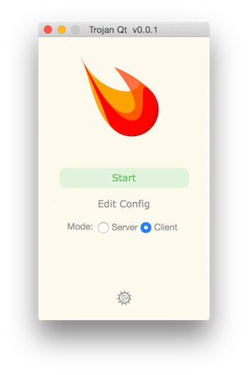
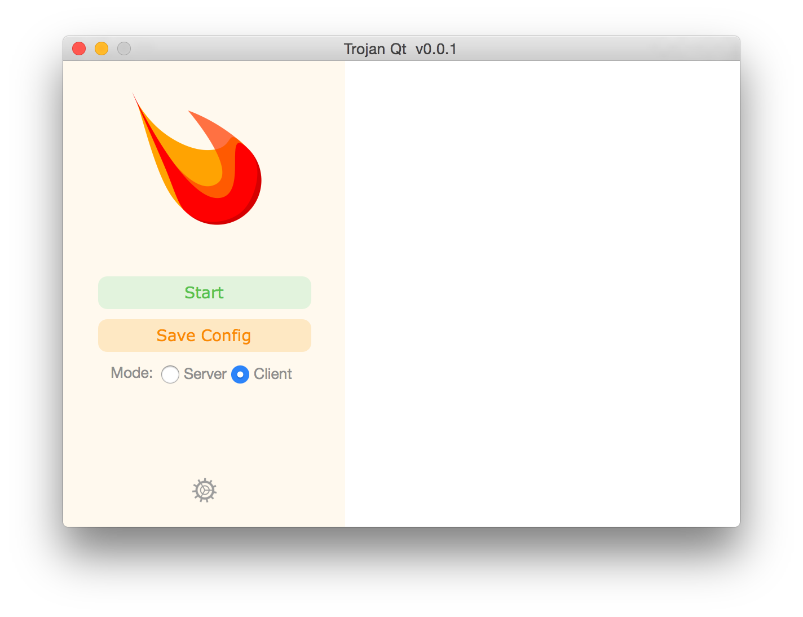

# Trojan Qt
#### The fancy GUI client and server of Trojan for desktops

* Trojan is an unidentifiable mechanism that helps you bypass GFW.
* Trojan features multiple protocols over TLS to avoid both active/passive detections and ISP QoS limitations.

## Documentation
An online documentation can be found [here](https://trojan-gfw.github.io/trojan/).

## Dependencies
- [Qt](https://qt.io/) >= 5
- [CMake](https://cmake.org/) >= 2.8.12
- [Boost](http://www.boost.org/) >= 1.54.0
- [OpenSSL](https://www.openssl.org/) >= 1.0.2

## Screenshots

## License
[GNU General Public License v3.0](LICENSE)

